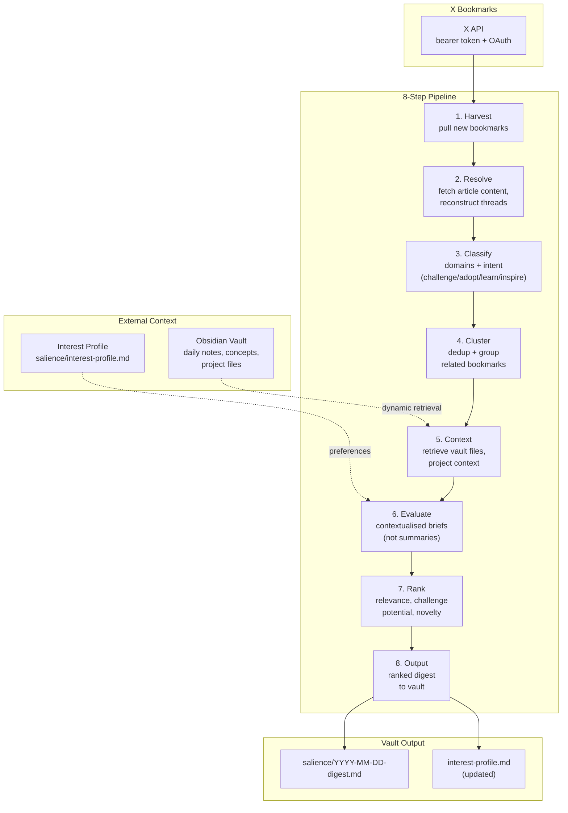
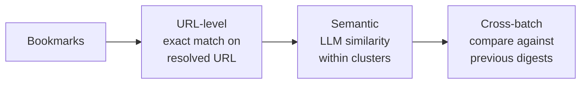
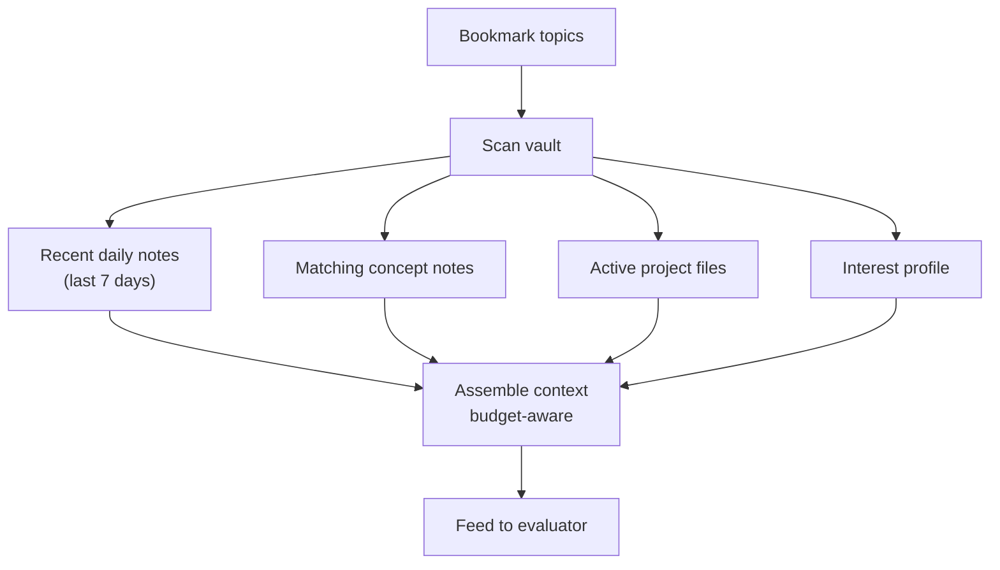

# Architecture

## System overview



## Pipeline detail

Each step maps to a module in `src/salience/`:

| Step | Module | Input | Output | LLM? |
|------|--------|-------|--------|------|
| Harvest | `harvest.py` | X API bookmarks | Raw bookmark list | No |
| Resolve | `resolve.py` | Bookmark URLs | Extracted article content, thread reconstructions | No |
| Classify | `classify.py` | Article content | Domain tags + intent labels | Yes |
| Cluster | `cluster.py` | Classified bookmarks | Deduplicated groups | No |
| Context | `context.py` | Bookmark topics | Relevant vault files, project context | No |
| Evaluate | `evaluate.py` | Bookmark + context | Contextualised briefs ("what it means for you") | Yes |
| Rank | `rank.py` | Evaluated briefs | Ordered by relevance, challenge potential, novelty | Yes |
| Output | `format.py` + `output.py` | Ranked briefs | Vault-formatted digest with entity links | No |

Three steps use LLM calls (classify, evaluate, rank). The rest are deterministic.

## Three-tier deduplication



Prevents the same article from appearing across multiple weekly digests even if bookmarked via different URLs or retweets.

## Context assembly



Context is assembled dynamically per bookmark – only relevant vault files are included, respecting context window budget. The interest profile provides stable preference signals; vault files provide recency.

## Configuration split

```
config.yaml          Structure – vault path, entity dirs, tags, model IDs, pipeline settings
.env                 Secrets – API keys, tokens (never committed)
macOS Keychain       Optional – bridge secrets via security commands
```

## Key design decisions

- **Briefs, not summaries** – the evaluator produces "what this means for you" contextualised against your active work, not neutral abstractions
- **Interest profile as feedback loop** – the profile tracks which domains, authors, and topics you engage with over time, shaping future ranking
- **Three LLM calls, not eight** – only classify, evaluate, and rank use the LLM. Everything else is deterministic. Keeps cost predictable and debugging tractable
- **Vault-native output** – digests are markdown with wikilinks and tags from the controlled vocabulary, ready for Obsidian and compilable by `/ingest`
